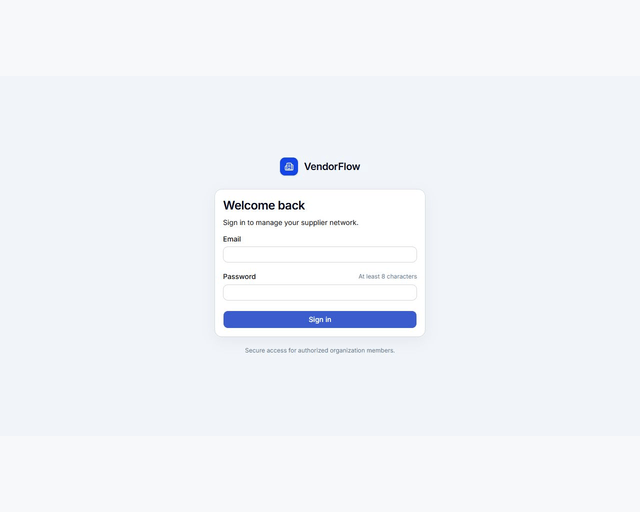
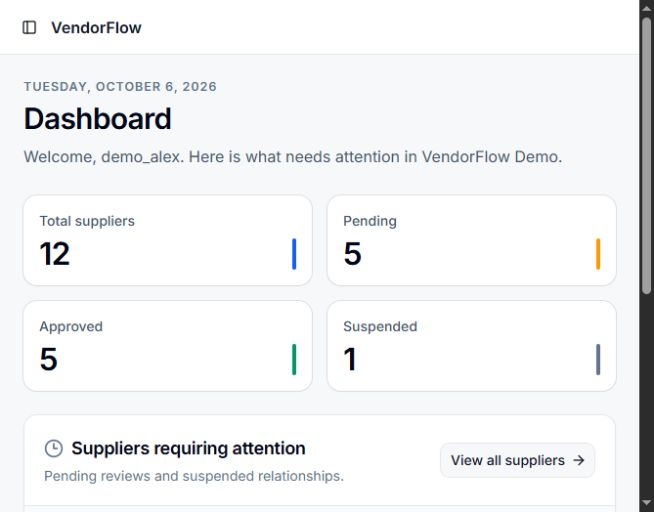
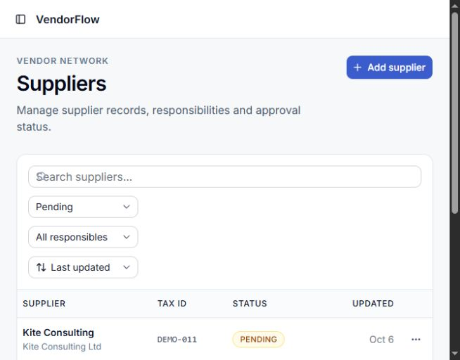
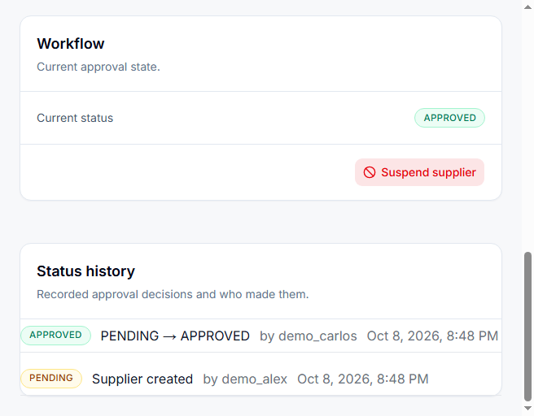
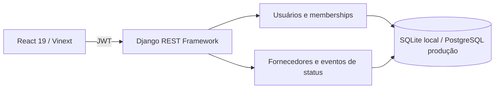

# VendorFlow

VendorFlow é uma aplicação B2B para cadastro e aprovação de fornecedores em múltiplas organizações. O MVP demonstra isolamento entre tenants, permissões por vínculo, fluxo de aprovação e trilha auditável de status.

## Demonstração visual



| Dashboard com métricas da API | Lista com filtro de status | Histórico de aprovação |
| --- | --- | --- |
|  |  |  |

O arquivo [docs/demo.gif](docs/demo.gif) é um vídeo curto em formato GIF, gerado a partir de capturas reais da aplicação local. Os nomes, e-mails e identificadores dos fornecedores de demonstração são fictícios.

Percurso de avaliação: entrar com a conta ADMIN de demonstração → abrir **Suppliers** → criar um fornecedor com identificador único → aprová-lo → abrir o detalhe e conferir o evento de aprovação, autor e data no histórico.

## Arquitetura



O frontend consulta a API para login, dashboard, lista, filtros, paginação, detalhe e mutações. O backend aplica as permissões mesmo quando uma rota é acessada diretamente. Cada usuário pode ter um papel diferente em cada organização.

| Ação | VIEWER | MANAGER | ADMIN |
| --- | :---: | :---: | :---: |
| Consultar fornecedores e histórico | ✓ | ✓ | ✓ |
| Criar e editar |  | ✓ | ✓ |
| Aprovar ou rejeitar pendentes |  | ✓ | ✓ |
| Suspender aprovados e excluir |  |  | ✓ |

As transições permitidas são `PENDING → APPROVED`, `PENDING → REJECTED` e `APPROVED → SUSPENDED`. Cada criação ou transição nova gera um evento com autor e data. Registros anteriores à migração não têm histórico retroativo inventado.

## Executar localmente

Requisitos: Python 3.9+, Node.js 22.13+ e npm.

```powershell
cd backend
py -m venv venv
.\venv\Scripts\Activate.ps1
pip install -r requirements.txt
python manage.py migrate
$env:VENDORFLOW_DEMO_PASSWORD="defina-uma-senha-de-12-caracteres-ou-mais"
python manage.py seed_demo
python manage.py runserver
```

Em outro terminal:

```powershell
cd frontend
Copy-Item .env.example .env.local
npm ci
npm start
```

Abra `http://localhost:3000`. O seed cria contas fictícias `alex@vendorflow.demo` (ADMIN), `carlos@vendorflow.demo` (MANAGER), `maria@vendorflow.demo` (VIEWER) e `nina@northstar.demo` (ADMIN de outra organização). Todas usam a senha fornecida em `VENDORFLOW_DEMO_PASSWORD` na primeira criação. O comando é idempotente e não redefine senhas de contas existentes.

## API

| Endpoint | Finalidade |
| --- | --- |
| `POST /api/auth/token/` e `/api/auth/token/refresh/` | Login e renovação JWT |
| `GET /api/me/` | Usuário autenticado |
| `GET /api/organizations/` | Organizações e papéis |
| `GET /api/organizations/{id}/members/` | Responsáveis válidos |
| `GET /api/organizations/{id}/suppliers/` | Busca, `status`, `responsible`, `ordering`, `page`, `page_size` |
| `GET /api/organizations/{id}/suppliers/summary/` | Métricas e itens que requerem atenção |
| `GET/POST /api/organizations/{id}/suppliers/` | Lista e criação |
| `GET/PATCH/DELETE /api/organizations/{id}/suppliers/{supplier_id}/` | Detalhe e manutenção |
| `POST .../{supplier_id}/approve/`, `reject/`, `suspend/` | Fluxo de status |

Documentação OpenAPI: `http://127.0.0.1:8000/api/docs/`.

## Verificação

```powershell
cd backend
.\venv\Scripts\python.exe manage.py test
cd ..\frontend
npm run lint
npx tsc --noEmit
npm run build
```

Os 34 testes de API cobrem autenticação e refresh, isolamento entre organizações, permissões dos três papéis, filtros, paginação, transições, histórico e idempotência do seed da demo. O percurso local também foi validado no navegador: login de ADMIN, aprovação e histórico; login de MANAGER, rejeição; login de VIEWER, bloqueio da criação; e redirecionamento ao login após logout.

A renovação automática do frontend foi conferida com `JWT_ACCESS_LIFETIME_SECONDS=2` no backend: depois de receber `401`, o cliente chamou `/api/auth/token/refresh/`, repetiu a requisição e manteve a lista disponível. O valor padrão continua em 300 segundos.

## Demonstração online

- Interface pública: [vendorflow-web.onrender.com](https://vendorflow-web.onrender.com/login)
- API: [vendorflow-api-rlbq.onrender.com](https://vendorflow-api-rlbq.onrender.com/api/health/)
- Documentação da API: [Swagger](https://vendorflow-api-rlbq.onrender.com/api/docs/)

O percurso sugerido é **login → Suppliers → Add supplier → Approve → histórico no detalhe**. As contas e os dados de demonstração são fictícios; use apenas dados fictícios neste ambiente público. As credenciais são fornecidas separadamente ao avaliador.

O frontend Vinext e a API Django rodam em serviços web gratuitos separados no Render; o PostgreSQL persistente fica no Neon. O [render.yaml](render.yaml) descreve a API, executa migrações e seed idempotente na inicialização e permite CORS para a interface. O frontend é um serviço Node com build `cd frontend && npm ci --include=dev && npm run build` e start `cd frontend && npm run start:production`. O frontend recebe `NEXT_PUBLIC_API_URL=https://vendorflow-api-rlbq.onrender.com/api` no Render.

O plano gratuito do Render pode suspender os serviços após inatividade, então o primeiro acesso pode demorar. As horas gratuitas são compartilhadas entre os dois serviços; confira [limites atuais do Render](https://render.com/docs/free) antes de usar a demo em uma apresentação.

`DATABASE_URL`, `DJANGO_SECRET_KEY` e `VENDORFLOW_DEMO_PASSWORD` permanecem configuradas no Render, não no repositório. Para uma implantação nova, informe um banco PostgreSQL com TLS e uma senha de demonstração própria. A senha do seed só é aplicada quando a conta fictícia é criada pela primeira vez.

## Decisão de escopo do plano antigo

| Item | Decisão |
| --- | --- |
| Histórico de status | **Incluído neste MVP.** Exibido no detalhe e persistido como eventos com autor e data. |
| Contatos adicionais | **Adiado.** E-mail e telefone principais permanecem; uma entidade de múltiplos contatos só entra se houver caso de uso real. |
| Importação/exportação CSV | **Adiada.** Não bloqueia este MVP nem o próximo projeto; reavaliar apenas se uma demo ou usuário exigir volume de dados. |

O próximo projeto pode começar após a publicação e revisão deste MVP, sem esperar contatos ou CSV.
